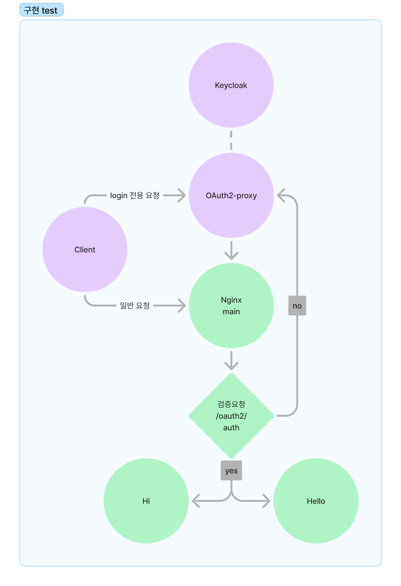
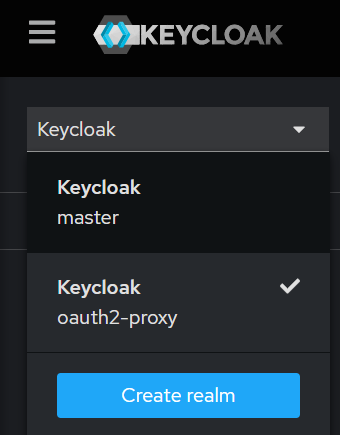
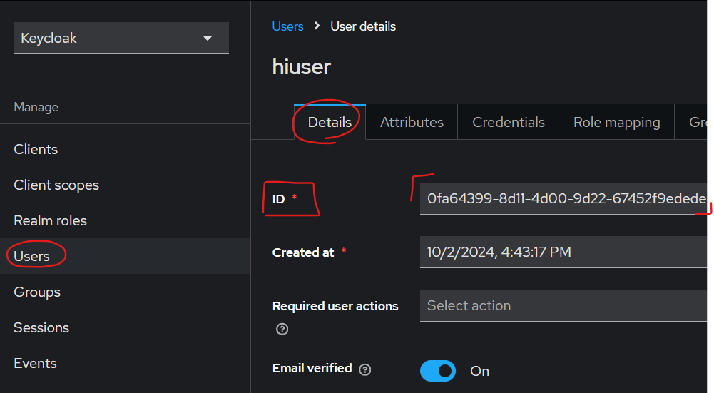

# OAuth2-proxy & Keycloak을 활용한 SSO(Single-Sign-On) 구현 연습

## 구성 아키텍처

- `nginx-main`에서 `oauth2-proxy` 를 통해 인증 처리
    - 인증이 안된 경우 keycloak에서 인증절차 진행
- `nginx-authentication`에서 `authentication-server` 를 통해 인가 처리 및 service routing
    - 인가가 안된 경우 403 에러

## 프로젝트 실행 방법

1. 프로젝트 clone
2. 프로젝트 root directory에서 `docker-compose up`

## 기본 세팅 및 테스트 방법

1. `keycloak.localtest.me:9080` 으로 접속하여 어드민 계정으로 로그인 (ID: admin / PW: admin)
2. 왼쪽 상단에 `realm`을 docker-compose의 command로 import한 `oauth2-proxy`로 변경
    
3. `Manage` - `Users` 탭에서 사용할 유저 생성
    - Email 입력 및 Email verified `On`
    - 등록한 유저의 id 확인
        
4. authentication-server에 생성한 유저의 api 호출권한 등록
    1) [GET] `localhost:8080/id/list` - 등록된 id 리스트 조회
    2) [GET] `localhost:8080/id/update?idType={id 타입}&id={권한을 부여할 유저id}` - 권한 부여
        - idType은 `ALL` / `HI` / `NONE` 3가지가 있으며, `ALL`은 Hi, Hello 모든 서버 접근 가능, `Hi`는 Hi 서버만 접근 가능, `NONE`은 모든 서버 접근 불가능.
        - 편의상 GET Mapping으로 업데이트 진행
5. 메인 landing page 접속 - `landing.localtest.me/`  
   5-1. 혹은 바로 서비스 url로 진입 가능   `hello-world.localtest.me/hello/1` / `hello-world.localtest.me/hello/2` / `hi-world.localtest.me/hi/1` / `hi-world.localtest.me/hi/2` 
6. 생성한 유저로 인증 및 권한에 맞는 서버에 요청하여 권한 확인

## 추가 세팅

1. 쿠키를 삭제해도 로그인 세션이 살아있는 경우
    - keycloak의 세션이 살아있어서 로그인 인증절차를 건너띄고 진입하게 됨.
    - keycloak의 `SSO Session Max` 값을 조절하여 해결 가능.
    - [oauth2-proxy의 realm 세팅 파일](keycloak/oauth2-proxy-realm.json) 에서 최초 세팅 가능.
2. oauth2-proxy의 쿠키 만료시간
    - `cookie_expire` 를 통해서 클라이언트에게 발급된 쿠키의 만료시간 세팅.