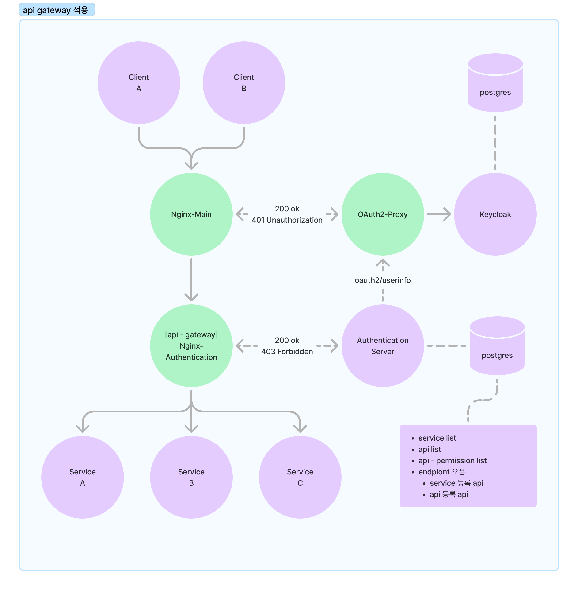

# OAuth2-proxy & Keycloak을 활용한 SSO(Single-Sign-On) 구현 연습

## 구성 아키텍처

## 프로젝트 실행 방법

1. 프로젝트 clone
2. `docker-compose up`

## 기본 세팅

1. `keycloak.localtest.me:9080` 으로 접속하여 어드민 계정으로 로그인 (ID: admin / PW: admin)
2. 왼쪽 상단에 `realm`을 docker-compose의 command로 import한 `oauth2-proxy`로 변경
    
3. `Manage` - `Users` 탭에서 사용할 유저 생성
    - Email 입력 및 Email verified `On`
4. 메인 landing page 접속 - `landing.localtest.me/`  
   4-1. 혹은 바로 서비스 url로 진입 가능   `hello-world.localtest.me/hello/1` / `hello-world.localtest.me/hello/2` / `hi-world.localtest.me/hi/1` / `hi-world.localtest.me/hi/2` 
5. 생성한 유저로 인증
6. hello <-> hi 서버 번갈아가면서 호출 가능함 확인